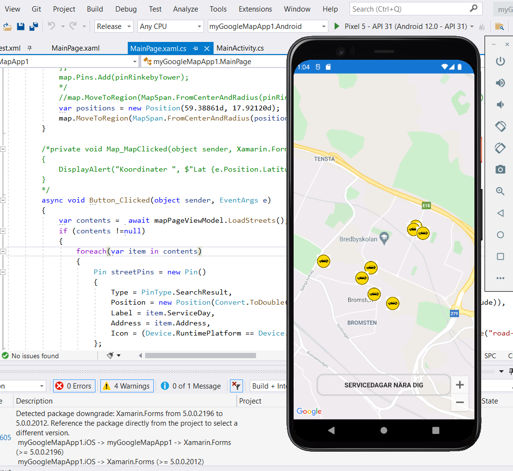

# myGoogleMapApp1
Visual Studio with Xamarin forms and GoogleMaps (Android)

Showing servicedays (parking) on the map with additional information, address, serviceday

Retrieved from ([openparking API](http://openparking.stockholm.se))

Visual Studio 2019 / .NET 5

Android / iOS

## Printscreen

